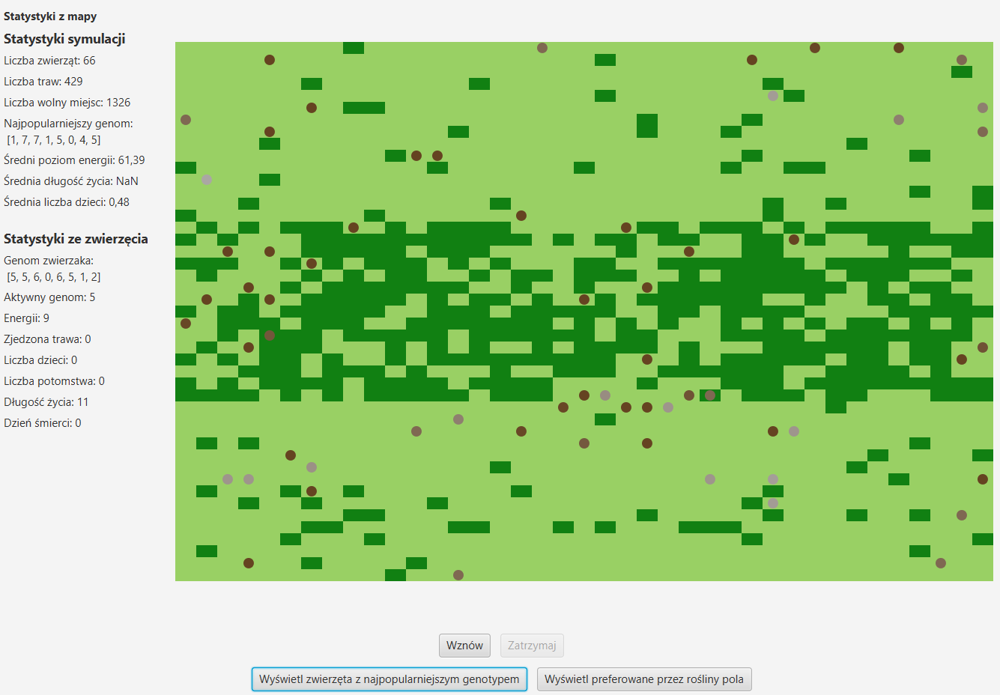
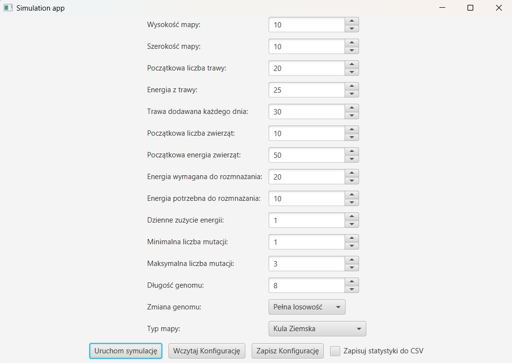
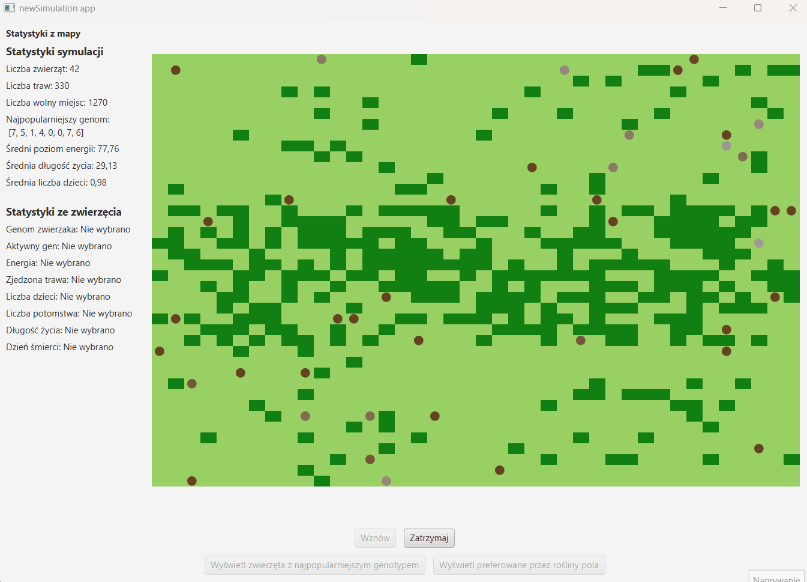

# Projekt: Darwin-World

A Java desktop application that simulates an ecosystem based on 
Charles Darwin's theory of natural selection. Users can customize map,
animal, and simulation parameters, observe real-time ecosystem dynamics, 
and analyze statistical data.

Authors:

Dariusz Marecik [[FloudMe77]](https://github.com/FloudMe77)
Paweł Gadomski [[Magmusacy]](https://github.com/Magmusacy)

## Task

the project was carried out as part of the "Object-Oriented Programming" course at the AGH University of Krakow.

The full content of the task being carried out is available [here](https://github.com/Soamid/obiektowe-lab/tree/master/proj) 
(variant D4).



## About

This project is introducing a dynamic ecosystem with digital organisms. Animals roam the map, feed on grass, and reproduce, passing their genes to the next generation. Mutations cause movement patterns to continuously evolve over time. The population is subject to natural selection—individuals perish from hunger, while grass regrows at a constant rate throughout the simulation.

The animals move across a two-dimensional map resembling a globe. Vegetation thrives in the jungle, located along the "equator"—the central band of the map. The rest of the landscape consists of a steppe, where grass grows more slowly, creating more challenging conditions for survival. In one variant of the simulation, a predator appears, clearly marked, that hunts herbivorous animals, further influencing the dynamics of the ecosystem.

## Simulation

Each step of the simulation consists of several key stages:

- Removal of deceased animals
- Movement of all animals
- Feeding animals that have moved onto grass-covered fields
- Reproduction of animals located on the same field
- Addition of a specified amount of grass to the map
- Both the animals and the simulation itself store important statistics, which include:

**Animal statistics**:

- Genome
- Currently active gene
- Energy level
- Number of grasses eaten
- Number of children
- Number of offspring
- Lifespan
- Day of death (if deceased)

**Simulation statistics**:

- Number of animals
- Number of grasses
- Number of available grass spaces
- Most popular genome in the population
- Average energy level of living animals
- Average lifespan of deceased animals
- Average number of children for all animals
- These data allow for a detailed analysis of the simulation’s progress and the   evolution of the population.

## Functionalities

### Configuring the initial simulation settings

Upon launching the program, a window will appear, allowing the user to adjust the initial simulation parameters. In this window, it will also be possible to load or save the set parameters to a file, as well as enable the option to automatically save the simulation statistics as a CSV file.



The following simulation parameters can be modified:

- Map height
- Map width
- Initial amount of grass
- Grass growth rate per day
- Initial number of animals
- Initial energy of animals
- Energy required for reproduction
- Energy consumed during reproduction
- Daily energy consumption
- Minimum number of mutations
- Maximum number of mutations
- Genome length
- Genome modification method:
  - Full randomness – mutation changes a gene to any other gene at random;
  - Full randomness – mutation may also result in two genes swapping places.
- Map type:
  - Spherical Earth – the left and right edges of the map loop around. The top and bottom edges are the poles—animals cannot enter these areas.
  - Wild Bear Territory – within a specified square subarea of the map lies the territory of the wild sow-bear. If an animal enters a square with the sow-bear, it is immediately consumed and dies.

### Logs

If enabled in the start window, the application records simulation logs to a CSV file. The log for each day includes the following details:

- Total number of animals present on the map
- Total number of plants
- Number of available empty spaces on the map
- The most common genotypes within the population
- Average energy levels of the animals
- Average lifespan of the animals
- Average number of offspring produced by the animals

These logs provide a comprehensive overview of the simulation's progress and the evolution of the ecosystem.

## Visualization



## Technologies
The project is entirely written in **Java**, using **JavaFX** for the graphical user interface and Gradle as the build automation and dependency management tool.

- **Java**: The primary programming language used to implement the simulation logic.
- **JavaFX**: A library for creating modern user interfaces.
- **Gradle**: A tool for automating the project's build process.

## Installation and Setup

To run the project locally, follow these steps:

1. Clone the repository:

   ```bash
   git clone https://github.com/FloudMe77/traffic_lights_system.git
   ```

2. Navigate to the project directory:

   ```bash
   cd Darwin-World
   ```

3. Build the project using Gradle:

   ```bash
   ./gradlew build
   ```

4. Run the application:

   ```bash
   ./gradlew run --args="fileInName fileOutName"
   ```